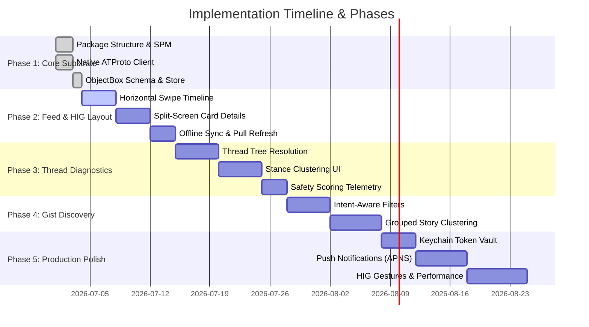

# Swift-Paper-ATProto — Implementation Roadmap & Phases

This document details the phased implementation roadmap for the **Swift-Paper-ATProto** application, detailing the path from a local-first architectural foundation to a production-ready, Apple HIG-compliant iOS/macOS social reader.

---

---

## Phase 1: Foundation & Core Substrate (Completed)

Establish the core communication layer and the high-performance local database substrate.

- [x] **SPM Multi-Target Architecture:** Define clear separation between compile-safe core modules (`SwiftPaperATProtoCore`) and SwiftUI interfaces (`swift-paper-atproto`).
- [x] **Native ATProto Client:** Async/await client using `URLSession` to manage sessions (`com.atproto.server.createSession`), retrieve feeds (`app.bsky.feed.getTimeline`), and query conversation graphs (`app.bsky.feed.getPostThread`).
- [x] **ObjectBox Caching Engine:** Integrate `objectbox-swift-spm` build tool plugins, defining `CachedPostEntity` schema and `LocalStore` transactional cache routines to store timelines locally.
- [x] **Telemetry & Diagnostics Consoles:** Connect diagnostic stats (latencies, cached sizes, active heuristics) into settings telemetry.

---

## Phase 2: Local-First Feed & HIG Layout (Active)

Implement the magazine-style reader interface prioritizing Apple HIG (Fluid gestures, cards, dark-mode styling).

- [ ] **Facebook Paper Timeline Pager:** Implement a custom SwiftUI horizontal scroll reader. The screen is split into a top hero pane for highlighted media and a bottom horizontal slider for neighboring post cards.
- [ ] **Gesture-Driven Detail Transitions:** Build interactive transition animations allowing users to swipe up on a thumbnail card to expand it into the main Hero view, or pinch-to-close.
- [ ] **Offline Sync & Cache Eviction:** Configure intelligent background synchronization:
  - Load cached timeline objects from ObjectBox immediately on boot.
  - Pull-to-refresh to fetch new items from the AppView server.
  - Automatically evict unbookmarked posts older than 7 days to maintain database sizing constraints.

---

## Phase 3: Thread Tree Resolution & Intelligence Layer

Bring the web version's "One AI System" visualizer to Swift. Renders conversation metrics alongside thread nodes.

- [ ] **Hierarchical Thread Tree:** Implement recursive UI layouts mapping parent-child relations with thin vertical alignment guides and indent cushions.
- [ ] **Stance Diversity Dashboard:** Renders visual metrics (Supportive / Skeptical / Analytical ratios) calculated from post contents.
- [ ] **Entity Centrality Visualizer:** Extract key topics and entities, styling them as indexable tags under the thread header.
- [ ] **Safety & Verification Telemetry:** Map local abuse ratings and factcheck compliance states into color-coded status badges.

---

## Phase 4: Neeva Gist-inspired Story Discovery

Transition search interfaces from flat keyword lists to narrative-driven story clusters.

- [ ] **Intent-Aware Query Processor:** Parse query values to classify user intent (Topics, Media, People, Feeds) before choosing layouts or weighting indices.
- [ ] **Story Clustering Compiler:** Group related post records into a single story card, showing:
  - An AI-synthesized editorial headline.
  - A summary text block.
  - Overlapping avatar badges representing all contributing handles in that story group.
  - Indicators of related references.

---

## Phase 5: Security, Notifications & Production Polish

Harden the application shell and prepare for App Store staging.

- [ ] **Keychain Integration:** Move access tokens (`accessJwt`, `refreshJwt`) from memory/UserDefaults to the Apple Keychain Service for secure storage.
- [ ] **APNS Push Notifications:** Establish background push receiver servers communicating with Bluesky AppViews to prompt real-time push alerts.
- [ ] **Performance Profile Audits:** Run Instruments templates (Time Profiler, Core Animation, Leaks) to verify ObjectBox database transaction speed and check for view rendering drops under 60/120fps.
